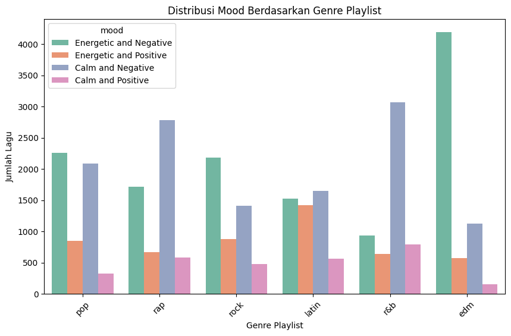

# **<center>Spotify Songs Analysis Report</center>**

<div align="center">
    
</div>

# <center>Analyzing 5000 Spotify Songs to Classify Moods</center>

## **Table of Content**
1. [**Introduction**](#Introduction)
2. [**Dataset Description**](#Dataset-Description)
3. [**Data Cleaning**](#Data-Cleaning)
4. [**Data Exploration**](#Data-Exploration)
5. [**Mood Variable Creation**](#Mood-Variable-Creation)
6. [**Visualization**](#Visualization)
7. [**Conclusion and Recommendations**](#Conclusion-and-Recommendations)
8. [**How to Run the Project**](#How-to-Run-the-Project)
9. [**Dependencies**](#Dependencies)
10. [**License**](#License)
11. [**Team**](#Team)

---

## **Introduction**
This project aims to analyze a dataset containing 5000 Spotify songs from various genres, including EDM, Latin, Pop, R&B, Rap, and Rock. Each song has several audio features, such as `danceability`, `energy`, `valence`, and `loudness`. The goal is to understand the relationships between these features and create a new variable, `mood`, to classify songs into different emotional categories.

---

## **Dataset Description**
The dataset contains the following key columns:
- `track_id`: Unique ID for each song.
- `track_name`: Name of the song.
- `track_artist`: Artist of the song.
- `track_popularity`: Popularity score of the song.
- `playlist_name`: Name of the playlist containing the song.
- `playlist_genre`: Genre of the playlist.
- Audio features: `danceability`, `energy`, `valence`, `loudness`, etc.

---

## **Data Cleaning**
Several steps were taken to clean the dataset:
1. **Imputation of Missing Values**:
   - For numerical columns, missing values were imputed with the mean.
   - For non-numerical columns, missing values were imputed with the value `"Unknown"`.

2. **Verification**:
   - Ensured no missing values remained in the cleaned dataset.
   - Confirmed that data types were consistent across all columns.

---

## **Data Exploration**
Key findings from data exploration include:
- **Distribution Analysis**: Features such as `danceability`, `energy`, `valence`, and `loudness` were analyzed for their distribution across different genres.
- **Correlation Analysis**: A significant correlation was observed between `energy` and `danceability`.
- **Genre Analysis**: Playlist genres were found to have a notable impact on the audio characteristics of songs.

---

## **Mood Variable Creation**
A new variable `mood` was created by combining `energy` and `valence`. The categories of mood are:
- **Energetic and Positive**: High energy and high valence.
- **Energetic and Negative**: High energy and low valence.
- **Calm and Positive**: Low energy and high valence.
- **Calm and Negative**: Low energy and low valence.

The distribution of songs across these mood categories was analyzed, showing that most songs fall under the `Energetic and Positive` category.

---

## **Visualization**
Several visualizations were created to support the analysis:
1. **Correlation Matrix**:  
   A heatmap of the correlation matrix showed strong relationships between audio features.  
   

2. **Mood Distribution**:  
   A bar chart visualized the distribution of songs across different mood categories.  
   

3. **Scatter Plot – Energy vs Valence**:  
   This plot shows how songs can be categorized into moods based on their energy and valence levels.  
   

---

## **Conclusion and Recommendations**
### **Conclusion**
This analysis demonstrates that audio features such as `energy` and `valence` play a significant role in determining the mood of a song. Additionally, playlist genres influence the characteristics of songs, which can be useful for music recommendation systems.

### **Recommendations**
1. **For Streaming Services**: Mood classification can enhance user experience by offering mood-based playlists and recommendations.
2. **For Music Producers**: Understanding how audio features contribute to mood can guide the production of songs with specific emotional impacts.
3. **Future Work**: A machine learning model could be developed to predict the mood of new songs based on their audio features.

---

## **How to Run the Project**
### **Steps**
1. Clone the repository to your local machine:
   ```bash
   git clone https://github.com/username/spotify-songs-analysis.git
   ```

2. Navigate to the project directory:
   ```bash
   cd spotify-songs-analysis
   ```

3. Install the required dependencies:
   ```bash
   pip install -r requirements.txt
   ```

4. Open the Jupyter Notebook:
   ```bash
   jupyter notebook SPOTIFY_GENRE.ipynb
   ```

5. Follow the steps in the notebook to run the analysis and generate visualizations.

---

## **Dependencies**
The project was tested using **Python 3.10**. Below are the required dependencies:
- `pandas`, version 1.4.3
- `numpy`, version 1.23.0
- `matplotlib`, version 3.5.2
- `seaborn`, version 0.11.2
- `jupyter`, version 1.0.0

Ensure you have these libraries installed by running the following command:
```bash
pip install -r requirements.txt
```

---

## **License**
This project is licensed under the MIT License, making it freely available for anyone to use and modify.

---

## **Team**
- **Data Analyst**: ALDI SMART NUR IRFANSYAH
- **Visualization Specialist**: RIFQI ARI PRASETYA
- **Documentation**: HASMARUDDIN

---
